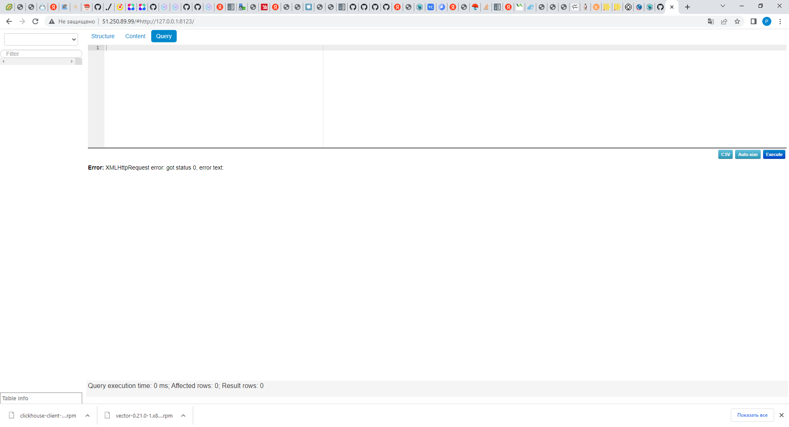

___

<h2>Group vars</h2>

 - Версия clickhouse 

          22.3.3.44

 - Паветы , которые будем устанавливать :

       - clickhouse-client
       - clickhouse-server
       - clickhouse-common-static

<h2>Описание Play</h2>

 - Get clickhouse distrib

        Скачивание дистрибутивов Clickhouse

 - Install clickhouse packages :

        Установка дистрибутивов Clickhouse
 - Start clickhouse service :

       Запуск Handler Start clickhouse service
 - Get vector distrib :

       Скачивание дистрибутива vector
 - Get libs1 distrib :

       Скачивание пакета gcc10-libstdc++-10.2.1-7.gf.el7.x86_64.rpm для работы vector
 - Install lib1 package :

       Установка пакета gcc10-libstdc++-10.2.1-7.gf.el7.x86_64.rpm

 - Install vector package :

       Установка пакета vector

 - Install requements

       Установка GIT
 - Inst nginx и Inst n1

       Установка nginx

 - test Iptables

       Сброс iptables для теста
 - enable nginx и start web 

       Добавление nginx в автозагрузку и запуск nginx
 - Clone 

       Клонирование lighthouse с github
 - remove old nginx data

       Удаление старых файлов nginx
 - copy new files

       Копирование файлов Lighthouse в корневую директорию веб-сервера
 - restart web

       Перезапуск сервиса nginx

 - 